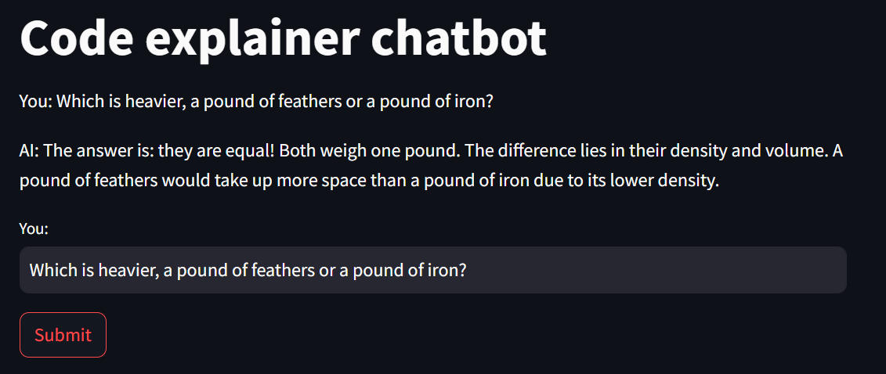

# How to run the Streamlit version

## Prereqs
First make sure you have the libraries already installed
`pip install streamlit` and `pip install openai` should do the trick!

If you run into problems with it recognizing OpenAI, then run `pip uninstall openai` , `pip -m pip cache purge` , then run `pip install openai` again. 

Next, make sure LM Studio is up and running. You can verify this by going into the application and checking that the server is started, or you can use curl. 
```
curl http://localhost:1234/v1/chat/completions \
  -H "Content-Type: application/json" \
  -d '{ 
    "model": "lmstudio-community/Meta-Llama-3-8B-Instruct-GGUF",
    "messages": [ 
      { "role": "system", "content": "Always answer in rhymes." },
      { "role": "user", "content": "Introduce yourself." }
    ], 
    "temperature": 0.7, 
    "max_tokens": -1,
    "stream": true
}'
```

## Running Streamlit
To actual start running the application, just do `streamlit run code_explainer.py`. This will start the application working on http://localhost:8501/ .

